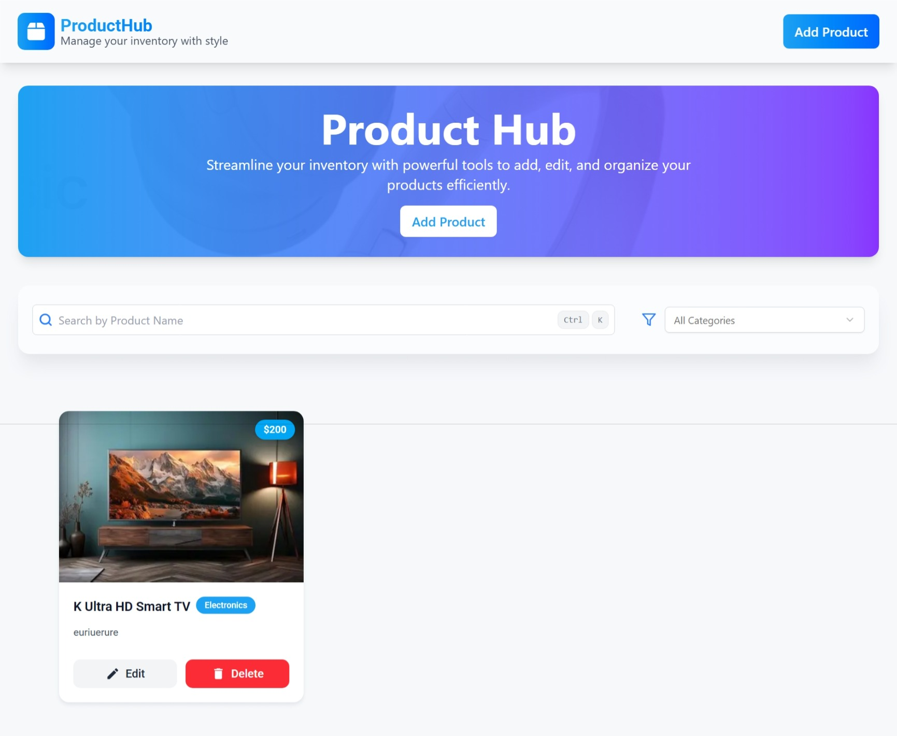

# 🛒 ProductHub – Product Management Dashboard  

## 📌 Overview  
**ProductHub** is a React.js-based product management dashboard that allows users to **display, add, edit, and delete products**.  
The app is built with **React.js, Tailwind CSS, shadcn/ui, and Firebase Firestore** for real-time product management.  

This project was developed as part of a **team assignment**.  
- **UI Development:** Handled by *Aravinth T* (React.js + Tailwind CSS + shadcn/ui components).  
- **API Integration & Form Validation:** Handled by *Karthika S* (Firebase Firestore CRUD integration, validation logic).  

---

## 🚀 Features  
- **Display Products** (Firestore integration)  
- **Add Product** (with form validation and Firestore storage)  
- **Edit Product** (update product details in Firestore)  
- **Delete Product** (remove products from Firestore)  
- **Search & Filter** (client-side search by name/category)  
- **Responsive UI** (built with Tailwind CSS + shadcn/ui)  

---

## 🛠️ Tech Stack  
- **Frontend:** React.js (React 18, Functional Components & Hooks)  
- **UI & Styling:** Tailwind CSS + shadcn/ui  
- **Database:** Firebase Firestore (real-time database)  
- **State Management:** React Hooks (`useState`, `useEffect`)  
- **Validation & API Handling:** Firebase SDK, custom validation  

---

## 📂 Project Structure  
```
ProductHub/
├── src/
│   ├── components/       # Reusable UI components
│   ├── pages/            # Home pages 
│   ├── lib/              # Firebase config & setup
│   ├── App.js            # Root component
│   ├── index.js          # Entry point
│   └── styles/           # Global styles
├── public/               # Static assets
├── package.json
└── README.md
```

---

## ⚙️ Setup & Installation  

1. **Clone the Repository**  
   ```bash
   git clone https://github.com/Aravinth-dev/ProductHub.git
   cd ProductHub
   ```

2. **Install Dependencies**  
   ```bash
   npm install
   ```

3. **Setup Firebase**  
   - Go to [Firebase Console](https://console.firebase.google.com/).  
   - Create a new project.  
   - Enable **Firestore Database**.  
   - Add your Firebase config inside `src/lib/firebase.js`:  

   ```javascript
   import { initializeApp } from "firebase/app";
   import { getFirestore } from "firebase/firestore";

   const firebaseConfig = {
     apiKey: "YOUR_API_KEY",
     authDomain: "YOUR_PROJECT_ID.firebaseapp.com",
     projectId: "YOUR_PROJECT_ID",
     storageBucket: "YOUR_PROJECT_ID.appspot.com",
     messagingSenderId: "YOUR_SENDER_ID",
     appId: "YOUR_APP_ID",
   };

   const app = initializeApp(firebaseConfig);
   export const db = getFirestore(app);
   ```

4. **Run the Development Server**  
   ```bash
   npm start
   ```
   The app will be available at `http://localhost:3000/`.  

---

## 👥 Team Contributions  

- **Aravinth T** – UI Development  
  - Built responsive UI using **React.js, Tailwind CSS, and shadcn/ui**  
  - Designed product cards, layout, and overall dashboard UI  

- **=Karthika S** – API Integration & Validation  
  - Integrated **Firestore CRUD operations**  
  - Implemented **form validation** for product addition & editing  

---

## 📸 Screenshots  
> 
>🔗 Live Demo: https://productub.netlify.app/
---

## 🎯 Deliverables Achieved  
✅ Modern **React.js product dashboard**  
✅ Real-time **Firestore database integration**  
✅ **Form validation** for safe product entry  
✅ Fully responsive **Tailwind + shadcn/ui** design  
✅ Team collaboration with clear task division  

---

## 👩‍💻 Authors  
- **Aravinth** 
- **karthika**  
